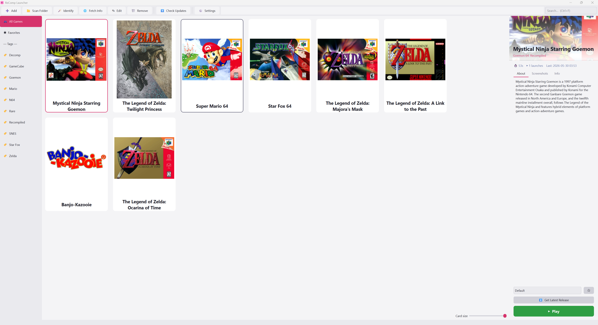

<div align="center">

# 🎮 ReComp Launcher

**A clean, modern launcher for Nintendo recompiled & decomp-ported games.**

Box art, descriptions, playtime tracking, one-click downloads and update checks —
all in one place. Built for the recomp scene.


[](https://discord.gg/QppkNN4rb3)
[](https://buymeacoffee.com/zikuju)

<br>



</div>

---

## ✨ Features

- **🖼 Box-art grid** — a resizable, drag-to-reorder library of cover art with a detail panel and hero banner.
- **🪄 Auto-identify** — point it at a folder and it recognizes known recomps by their executable (`soh.exe` → *Ocarina of Time*, `2ship.exe` → *Majora's Mask*, and [15+ more](#-supported-recomps)). No manual renaming.
- **🌐 Art & info, zero setup** — pulls box art and descriptions from **Wikipedia** automatically. Optional **SteamGridDB** key for premium curated covers.
- **⬇ One-click downloads** — grab the latest Windows build of any game straight from its GitHub release. Perfect if you're new to recomps.
- **⬆ Update checking** — checks each game's GitHub releases on launch and badges any card with an available update.
- **⏱ Playtime tracking** — playtime, last-played, and launch counts, tracked automatically.
- **🏆 RetroAchievements** — link your RA account and every game gets a 🏆 tab showing the official achievement set and your unlocks. Game IDs auto-match by title.
- **🚀 Launch profiles** — per-game command-line profiles for mods, configs, and save slots.
- **🎮 Controller support** — Xbox (XInput) **and** PlayStation (DualSense / DualShock 4, USB or Bluetooth) pads work out of the box, no setup: browse the grid, launch games, and drive Big Picture from the couch.
- **🖥 Big Picture mode** — a fullscreen, controller-first view (`F11` or the Start button) with giant cover art, Steam-style. **A** to play, **B** to exit, **Y** to favorite. Fully skinnable: drop any image named `bigpicture_bg.png` into your `data/` folder and it becomes the backdrop, auto-dimmed for readability.
- **🎨 Themes** — Dracula, Nord, Midnight, and Light.
- **⌨ Polish** — keyboard shortcuts, system-tray support, per-game screenshot galleries.

---

## 📦 Installation

### Option A — Download the .exe (no Python needed)

Grab the latest `ReCompLauncher.exe` from the [**Releases**](../../releases) page and run it.

### Option B — Run from source

```bash
git clone https://github.com/ZakyPew/ReCompLauncher.git
cd ReCompLauncher
pip install -r requirements.txt
python recomplauncher.py
```

Requires **Python 3.10+**.

---

## 🚀 Quick start

1. Launch the app.
2. Click **📁 Scan Folder** and point it at where you keep your recomp games — known titles are auto-recognized.
3. (Or click **➕ Add** for a single game, or **⬇ Get Latest Release** to download one fresh from GitHub.)
4. Select a game and hit **🌐 Fetch Info** to pull box art and a description.
5. Press **▶ Play**.

> **Note:** ReComp Launcher is a *front-end*. It does not contain any games or copyrighted ROMs — you supply your own legally-dumped games to each recomp, exactly as those projects require.

---

## 🕹 Supported recomps

Auto-identified out of the box (the list lives in `KNOWN_RECOMPS` in [`recomplauncher.py`](recomplauncher.py)):

| Game | Project | Platform |
|------|---------|----------|
| Ocarina of Time | Ship of Harkinian | N64 |
| Majora's Mask | 2 Ship 2 Harkinian / Zelda64Recompiled | N64 |
| Star Fox 64 | Starship | N64 |
| Perfect Dark | perfect_dark | N64 |
| Banjo-Kazooie | BanjoRecomp | N64 |
| Mystical Ninja Starring Goemon | Goemon64Recomp | N64 |
| Doom 64 | Doom64EX-Plus | N64 |
| Super Mario 64 | sm64ex / sm64plus / sm64coopdx | N64 |
| A Link to the Past | zelda3 | SNES |
| Twilight Princess | Dusk | GameCube |
| Sonic Unleashed | UnleashedRecomp | Xbox 360 |
| Sonic 1 & 2 (2013) | RSDKv4 Decompilation | Sega |
| Sonic CD (2011) | RSDKv3 Decompilation | Sega |
| Jak and Daxter | OpenGOAL | PS2 |

**Adding a recomp is a one-entry change** — see [CONTRIBUTING.md](CONTRIBUTING.md). PRs welcome!

---

## 🏆 RetroAchievements

Paste your RA username and [Web API key](https://retroachievements.org/settings) into
**Settings**, and each game's **🏆 tab** shows the official RetroAchievements set with
your unlock progress. IDs auto-match by title (override per game via Edit → Find…).

**Honest caveat:** no recomp can *earn* RetroAchievements today. RA hooks emulator
memory, and [treats native ports as standalone games](https://docs.retroachievements.org/general/standalone-support.html)
whose developers must integrate support themselves — none have yet
([Zelda64Recomp has an open request](https://github.com/Zelda64Recomp/Zelda64Recomp/issues/506)).
Unlocks shown here are the ones you earn playing through an RA-enabled emulator.
Notably, **Unleashed Recompiled ships its own built-in achievement system** (a native
recreation of the Xbox 360 set) — no launcher setup needed there. If a recomp adds
official RA support later, this launcher is ready to meet it.

---

## 🖼 Custom Big Picture background

Big Picture looks for a backdrop image in this order:

1. `data/bigpicture_bg.png` (also `.jpg` / `.jpeg` / `.webp`) — **your** image, never touched by updates
2. `assets/bigpicture_bg.png` — the project default

Any resolution works: the image is cover-scaled to your screen and dimmed so covers
and text stay readable. Delete the file to go back to the plain gradient.

---

## 🐧 Linux

The launcher runs from source on Linux:

```bash
pip install -r requirements.txt
python recomplauncher.py
```

- **⬇ Get Latest Release** automatically picks Linux builds (Linux-X64 archives, AppImage, Flatpak as fallback) instead of Windows ones.
- **📁 Scan Folder** finds `.AppImage` files as well as `.exe`.
- An experimental prebuilt Linux binary is produced by CI on releases.
- **Current limitation:** controller support (XInput / DualSense) is Windows-only for now — keyboard fully drives Big Picture on Linux. Contributions welcome (evdev)!

---

## 🛠 Building the .exe yourself

```bash
pip install pyinstaller
pyinstaller --noconfirm --onefile --windowed --name ReCompLauncher recomplauncher.py
```

The standalone executable lands in `dist/`. (CI does this automatically for every tagged release — see [`.github/workflows/build.yml`](.github/workflows/build.yml).)

---

## 🤝 Contributing

The most valuable contribution is **adding more recomps to the fingerprint database** so the launcher recognizes them automatically. It's a single dictionary entry — see [CONTRIBUTING.md](CONTRIBUTING.md).

---

## 💬 Community & support

- **Need help or want to chat?** Join the [Discord](https://discord.gg/QppkNN4rb3).
- **Like the project?** You can [buy me a coffee](https://buymeacoffee.com/zikuju) ☕ — it's hugely appreciated and helps keep development going.

(Both are also available in-app via the **❤ Support** and **💬 Get Help** toolbar buttons.)

---

## 📄 License

[GPLv3](LICENSE) © contributors. ReComp Launcher is fan-made and not affiliated with Nintendo or any recomp project.
